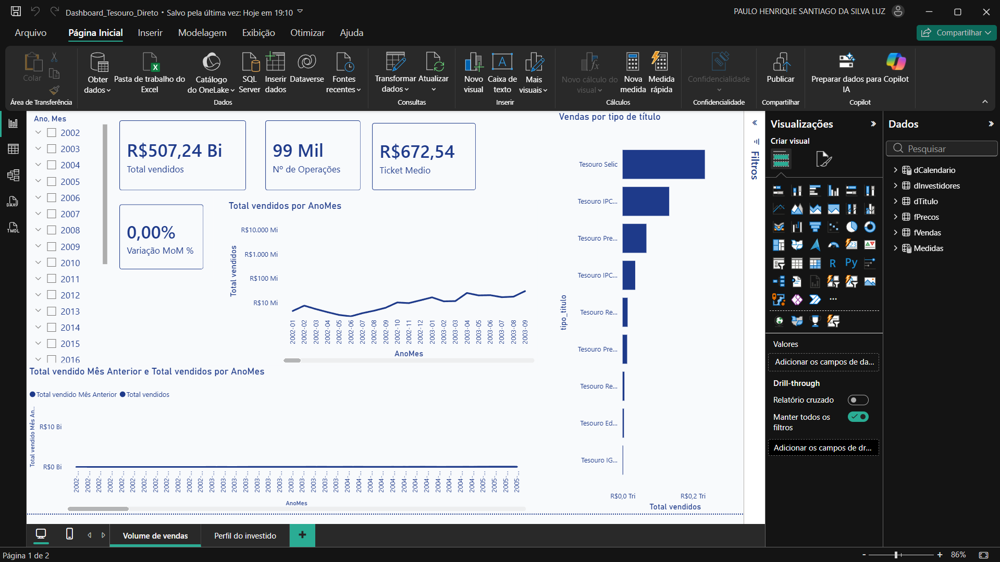

# 💰 Dashboard Tesouro Direto — Comportamento do Investidor Brasileiro (Power BI + MySQL)

> Projeto de Business Intelligence ponta a ponta: da ingestão de dados públicos reais em MySQL até a modelagem dimensional e visualização em Power BI.




---

## 📌 Sobre o projeto

Como o brasileiro investe no Tesouro Direto — e como isso mudou desde 2002? Essa foi a pergunta de negócio que guiou este projeto, construído a partir de **dados públicos reais** do Tesouro Nacional (vendas, preços/taxas e perfil de investidores), com mais de **2,8 milhões de linhas** ao todo.

Diferente do Projeto 1 (dados fictícios), aqui o desafio foi outro: pegar uma base real, suja e desestruturada — CSVs com encoding quebrado, vírgula decimal, datas em texto — e transformar isso numa base analítica confiável, do zero, usando SQL puro.

> ⚠️ **Nota:** os dados são públicos e de livre acesso, disponibilizados pelo Tesouro Nacional.

**Pergunta de negócio central:** *Quais títulos o brasileiro mais compra, como o volume evolui ao longo do tempo, e qual o perfil de quem investe?*

---

## 🎯 Objetivos

- Qual o volume total vendido e como ele evolui mês a mês?
- Quais tipos de título são mais vendidos?
- Qual o ticket médio por operação?
- Qual o perfil predominante do investidor brasileiro (profissão, idade, gênero, UF)?

---

## 🛠️ Ferramentas e técnicas

| Categoria | Tecnologias |
|---|---|
| Banco de Dados | MySQL 8.0 (Workbench) |
| Visualização & Modelagem | Power BI Desktop |
| Linguagem de Medidas | DAX (Data Analysis Expressions) |
| Modelagem de Dados | Star Schema com dimensões conformadas |
| Consulta de Dados | SQL (LOAD DATA, CTEs, Window Functions, JOINs, Subqueries) |

---

## 🗂️ Arquitetura dos dados — Star Schema (2 fatos, dimensões conformadas)

Diferente de um Star Schema clássico com um único fato, este modelo tem **duas tabelas fato** (`fVendas` e `fPrecos`) que compartilham as mesmas dimensões — um padrão chamado *dimensões conformadas*.

```
                    ┌───────────────┐
                    │  dCalendario  │
                    └───────┬───────┘
                            │
        ┌───────────────┐  │  ┌───────────────┐
        │    fVendas    │◄─┼─►│    fPrecos    │
        │    (FATO)     │  │  │    (FATO)     │
        └───────┬───────┘  │  └───────┬───────┘
                │           │          │
                └─────► dTitulo ◄──────┘


        dInvestidores  ← ISOLADA (bloco analítico à parte)
```

**Decisão de arquitetura:** `fVendas` não possui código do investidor (dado anonimizado na fonte) — não existe chave para ligar "quem comprou o quê". Em vez de forçar uma relação inexistente (erro comum de quem está começando), a `dInvestidores` foi mantida isolada, em página própria do dashboard, para análise de perfil independente. Reconhecer quando **não** relacionar duas tabelas é tão importante quanto saber relacionar.

**`dTitulo`** é uma dimensão-ponte criada via `UNION` dos títulos únicos de `fVendas` e `fPrecos`, com uma surrogate key (`id_titulo`, `AUTO_INCREMENT`) — resultado: 173 títulos únicos, carimbados nas duas fatos via `UPDATE ... JOIN`.

### Pipeline de dados (MySQL)

1. **Camada raw:** todas as colunas como `VARCHAR`, para garantir que nenhuma linha fosse rejeitada na importação.
2. **`LOAD DATA LOCAL INFILE`** para os 3 CSVs (vendas: 99 mil linhas, investidores: 2,76 milhões, preços: histórico desde 2002).
3. **Limpeza e tipagem:** `STR_TO_DATE` para datas em texto, `CAST(REPLACE(coluna, ',', '.') AS DECIMAL)` para vírgula decimal brasileira.
4. **Validação:** contagem de linhas, amostra visual e teste de encoding (acentuação) em cada etapa — nunca confiar que "deu verde" sem inspecionar.

---

## 📐 Medidas DAX desenvolvidas

```dax
Total vendidos = SUM(fVendas[valor])

Qtd Titulos Vendidos = SUM(fVendas[quantidade])

Nº de Operações = COUNTROWS(fVendas)

Ticket Medio = DIVIDE([Total vendidos], [Qtd Titulos Vendidos])
```

**Inteligência de tempo:**

```dax
Total vendido Mês Anterior =
CALCULATE(
    [Total vendidos],
    DATEADD(dCalendario[Date], -1, MONTH)
)

Variação MoM % =
VAR _ATUAL = [Total vendidos]
VAR _ANTERIOR = [Total vendido Mês Anterior]
RETURN
    DIVIDE(_ATUAL - _ANTERIOR, _ANTERIOR)
```

> 💡 Uma decisão importante de modelagem: os relacionamentos com `dCalendario` usam a **data do evento** (`data_liquidacao` em vendas, `data_base` em preços) — e não a data de vencimento do título. Ligar pelo vencimento faria vendas de 2024 aparecerem "no futuro" (2054, 2084...), distorcendo qualquer análise temporal.

---

## 📊 Visualizações do dashboard

**Página 1 — Volume de Vendas:**
- KPIs principais: Total Vendido, Nº de Operações, Ticket Médio, Variação MoM%.
- Evolução do total vendido por mês, com comparação ao mês anterior.
- Vendas por tipo de título.
- Slicer hierárquico Ano/Mês para navegação temporal.

**Página 2 — Perfil do Investidor** (bloco analítico isolado):
- Distribuição de investidores por profissão, idade, gênero e UF.

---

## 💡 Insights e resultados

- O **Tesouro Selic** domina o volume de vendas entre os tipos de título — comportamento coerente com o perfil conservador do investidor brasileiro médio.
- Encontrei uma inconsistência histórica de nomenclatura na fonte: o mesmo produto aparece como "Tesouro RendA+" e "Tesouro Renda+ Aposentadoria Extra" em períodos diferentes (idem "Tesouro Reserva", nome antigo do Selic). Optei por manter a chave fiel à fonte e não "corrigir" o texto original, para não quebrar o relacionamento com as tabelas fato — uma correção de exibição pode ser aplicada depois, na camada de visualização, sem alterar o dado de origem.
- A taxa do Tesouro Selic aparece negativa em alguns registros históricos (ex: 2008-2013) — não é erro de importação, é o comportamento real do ágio/deságio sobre a taxa Selic.
- A separação em dois blocos analíticos (vendas/preços vs. perfil do investidor) evitou um erro comum: forçar uma relação entre tabelas sem chave em comum, o que geraria números inflados ou incorretos.

---

## 🚀 Como foi construído

1. **Definição da pergunta de negócio** e mapeamento das 3 fontes de dados públicas.
2. **Engenharia de dados em MySQL** — importação, limpeza e tipagem de ~2,8 milhões de linhas.
3. **Modelagem dimensional** — construção da dimensão-ponte `dTitulo` e definição consciente do isolamento de `dInvestidores`.
4. **Conexão Power BI ↔ MySQL** e criação da dimensão Calendário via DAX.
5. **Medidas DAX** — métricas de negócio e inteligência de tempo.
6. **Construção e polimento do dashboard** — 2 páginas, KPIs, slicers.
7. **Validação de queries SQL** — 7 exercícios de CTEs, window functions e subqueries aplicados sobre um banco relacional próprio.

---

## 🔭 Próximos passos

- Publicar no Power BI Service para link compartilhável.
- Adicionar medida de participação percentual por tipo de título.
- Cruzar receita/taxa com volume vendido para identificar se o brasileiro compra mais quando a rentabilidade está mais alta.

---

## 🧠 Habilidades demonstradas

`MySQL` · `SQL (CTEs, Window Functions, JOINs, Subqueries)` · `Power BI` · `DAX` · `Star Schema com dimensões conformadas` · `ETL` · `Modelagem Dimensional` · `Storytelling de Dados`

---

## 👤 Autor

**Paulo Henrique Santiago da Silva**
Analista de Dados e Custos Logísticos | Power BI · SQL · Excel

- 🔗 LinkedIn: [linkedin.com/in/hpaulo13](https://www.linkedin.com/in/hpaulo13/)
- 📧 hpaulo669.ph@gmail.com

Este é o segundo de uma série de projetos de portfólio construídos durante minha transição de carreira para Análise de Dados / Business Intelligence. [Confira o Projeto 1 — Dashboard de Controle de Agregados](https://github.com/PH-Santiago13/dashboard-controle-agregados).
